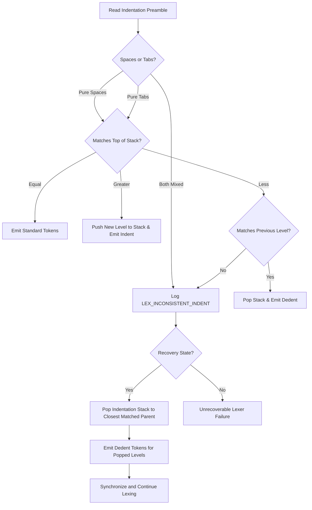
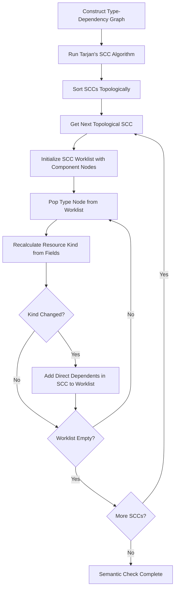
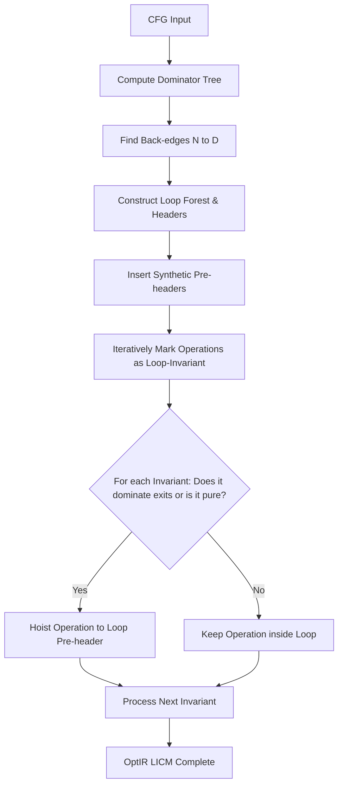
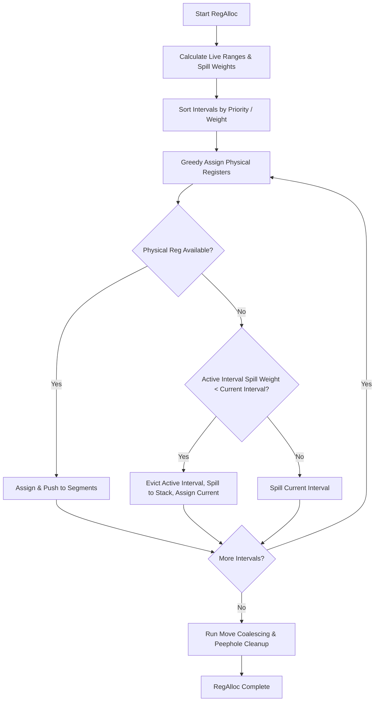
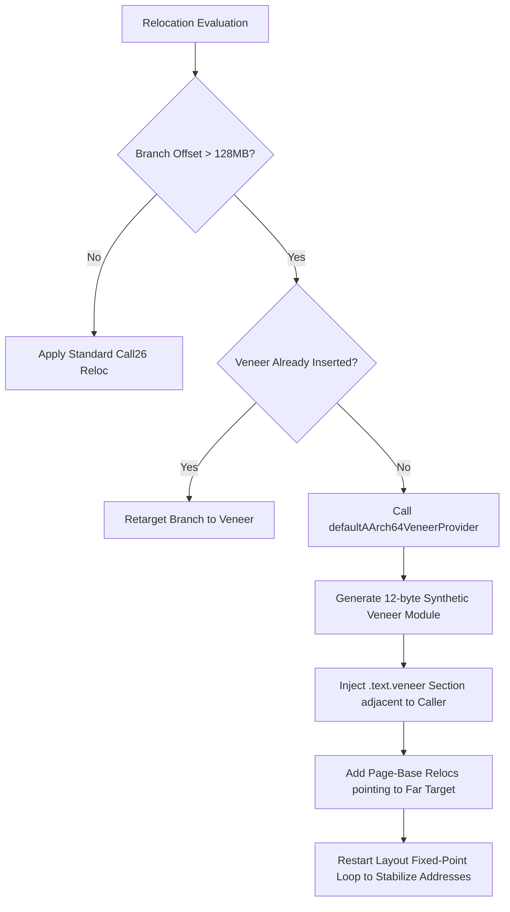

# Thermonuclear Codebase Review: Transforming Wrela from a Compiler into a World-Class Production System

This document provides a rigorous, deep-dive architectural and implementation review of the Wrela compiler codebase. Guided by the extremely strict guidelines of the **thermo-nuclear-code-quality-review** skill and compiler construction best practices, this review analyzes current abstractions, identifies local and structural cleanup opportunities, exposes subtle bugs/gaps, and details a precise engineering blueprint to elevate Wrela into a world-class, production-grade, formally verified UEFI AArch64 compiler.

---

## 1. Executive Summary & Core Philosophy

The Wrela compiler is a highly advanced, proof-carrying compiler compiling a modern resource-aware system language directly to freestanding UEFI AArch64 PE/COFF images (`.efi`). Its architecture is exceptionally clean and well-structured, employing sophisticated designs such as:

- A **Red/Green Syntax Tree** (Roslyn-style) for high-fidelity source representation, full trivia preservation, and precise diagnostics.
- A **formal proof-carrying pipeline** (`proof-mir` and `proof-check`) that validates linear resource obligations, `take` session scopes, terminal exits, and platform safety contracts using dominance-based static entailment.
- An **E-Graph and rewrite-driven optimizer** (`opt-ir`) performing whole-program monomorphization and SSA-based optimizations (SCCP, LICM, GVN, Vectorization).
- An **explicit fact-propagation cascade** in the AArch64 backend, ensuring security properties (no-spill, wipe-on-spill, constant-time) are co-designed with physical resource constraints.

Despite these advanced pillars, the current system exhibits several "toy-like" characteristics:

1. **Standard Library Bareness:** The standard library (`stdlib/wrela-std`) is exceptionally skeletal. It contains only minor wrappers for boot services and a very narrow VirtIO net driver, making it insufficient for real-world application or OS bringup.
2. **Single-Threaded Compilation Pipeline:** The compiler pipeline runs sequentially in Bun/TypeScript. It lacks a parallel, worker-pool architecture for parsing, semantic checking, and codegen, limiting scalability on large codebases.
3. **Naively Represented Red/Green Syntax Trees:** The CST nodes are heavy, heap-allocated JavaScript objects, which will trigger massive memory overhead and GC pressure under large-scale compilation.
4. **Greedy Linear Scan Allocator Limitations:** The register allocator in `src/target/aarch64/backend/allocation/allocator.ts` uses a simplified linear-scan approach with fixed default physical pools. It lacks global spill-cost minimization, rematerialization-guided eviction, and register-coalescing integration.
5. **Dormant and Incomplete Verification Lanes:** Multiple verification steps are flagged as "dormant" or require "prior-phase true-up" (such as a unified, typed-subject fact-extension registry and formal Lean-to-TypeScript verdict synchronization).
6. **Passive Block-Indentation and Fragile Recovery:** The parser acts as a passive consumer of `IndentToken` and `DedentToken` streams. The parser cannot instruct the lexer to synchronize or recover its indentation stack, leading to cascading downstream syntax errors.
7. **Degenerate Loop Invariant Code Motion (LICM):** The loop invariant code motion pass does not analyze loops, headers, dominators, or data dependencies. It is a degenerate pass that simply hoists whatever `loopOperationIds` the caller labels as pure.
8. **Monomorphizer Recursion Ban:** Both monomorphic and polymorphic recursion are strictly banned, rather than permitting bounded monomorphic recursion and verifying stack safety statically.
9. **16-Bit Constant Rematerialization Constraint:** Constant rematerialization is hard-constrained to 16-bit values. If a 32-bit or 64-bit constant needs rematerializing during register allocation pressure, the backend aborts with an allocation failure.
10. **Linker Veneer Generator Stub:** The layout engine supports calling a `veneerProvider` when branch offsets exceed the 26-bit immediate range, but no veneer provider is actually implemented. Without a default provider, linking larger executables fails permanently.

---

## 2. Compiler Frontend: CST, Lexer & Parser

### 2.1 The Red/Green CST Memory Footprint Problem

Wrela's syntax system (`src/frontend/syntax/`) represents Green and Red nodes as individual JavaScript class instances (`GreenNode`, `RedNode`).

- **The Smell:** Every token, trivia element, and syntax node is a fully heap-allocated object. For a 100,000-line codebase, this represents millions of objects, causing high garbage collection latency in Bun.
- **The Code Judo Move:** Transition to an **index-based, flat-array CST representation** (similar to modern rust-analyzer or swc).
  - Store all syntax tokens and nodes in unified flat arrays: `Uint32Array` buffers representing parent/child indices, spans, and syntax kinds.
  - Implement the Red tree as a _virtual/transient_ wrapper view that allocates lightweight objects on-the-fly _only_ during active traversal/querying, throwing them away immediately.
  - Expose this refactoring behind the existing `SyntaxTree` interface so that AST views (`src/frontend/ast/`) do not require invasive rewrites.

### 2.2 Lexer Indentation & Recovery Bug

In `src/frontend/lexer/lexer.ts#processLineIndentation`, if a tab character is mixed with space indentation, a `LEX_INCONSISTENT_INDENT` diagnostic is logged, but the lexer continues to canonicalize the indentation and push/pop levels on the stack without resetting or synchronizing. This results in cascading downstream parser errors.

- **Potential Bug:** Inconsistent indentation characters or incomplete statements at the end of the file can push the lexer/parser into an unrecoverable state where blocks are mismatched, emitting incorrect `Dedent` tokens that bypass syntax errors and crash downstream stages.
- **The Solution:** Evolve `measureIndentation` in `lexer.ts` to strictly reject mixed indentation characters (throwing or accumulating a lexer error diagnostic when spaces and tabs are mixed in a single line preamble).
- **Robust Indentation Recovery State Machine:** Ensure the `indentationStack` in the lexer is explicitly self-healing. When inconsistent indentation is hit, the lexer must pop the indentation stack until it matches a valid previous level, or fall back to a recovery anchor.



### 2.3 Passive Parser Indentation Synchronization Gap

In `parser-context.ts` and `block-parser.ts`, the parser is completely passive regarding indentation levels, matching only `IndentToken` and `DedentToken` streams. The parser cannot instruct the lexer to synchronize or recover its indentation stack, making block mismatch recovery extremely fragile.

- **The Smell:** When a parsing error occurs within an nested block, the parser attempts recovery by skipping to the next statement or block boundary. However, because the lexer's indentation stack remains unchanged, the lexer continues to emit outdated `Dedent` or `Indent` tokens, causing a torrent of cascading parse errors that obscure the true root cause.
- **The Remedy:** Implement **Active Indentation Synchronization**.
  - Provide a back-channel from the parser to the lexer's indentation stack.
  - When the parser enters statement recovery (e.g., at a semicolon or keyword boundary), it can query the expected indentation level of the target recovery block.
  - The parser then instructs the lexer to force-synchronize its indentation stack to that specific nesting level, purging any pending or mismatched indentation tokens.

---

## 3. Semantic Analysis, Type-Inference & Monomorphization

### 3.1 Resource-Kind Fixpoint Inference Optimization

In `src/semantic/surface/semantic-surface-checker.ts#L122-L151`, the compiler runs an iterative fixpoint algorithm to derive the resource kinds of user-defined types (e.g., classifying them as `unique edge`, linear, or ordinary).

- **The Performance Issue:** The loop currently executes a maximum of `index.types().length + 1` iterations. This performs a nested scan over all field entries in every iteration of the outer type loop ($O(N^2)$ worst-case). For large codebases, this scales quadratically.
- **The Solution:** Replace the nested loop with a **worklist-driven strongly connected components (SCC) propagation**.
  - Construct a dependency graph where type $A$ depends on type $B$ if $A$ contains a field of type $B$.
  - Compute SCCs using Tarjan's or Kosaraju's algorithm.
  - Run the resource-kind fixpoint algorithm strictly _per SCC_ in topological order. Inside each SCC, propagate changes only to direct dependents using a worklist.
  - This reduces the propagation complexity to $O(V + E)$, accelerating semantic analysis on massive multi-module projects.



#### TypeScript Worklist Blueprint for `semantic-surface-checker.ts`

Below is the complete architectural implementation blueprint to replace the naive $O(N^2)$ loop:

```typescript
import { type TypeId, type ResourceKind } from "../ids";

interface TypeDependencyNode {
  readonly typeId: TypeId;
  readonly fields: readonly TypeId[];
  resourceKind: ResourceKind;
}

export function computeResourceKindsFixpoint(types: Map<TypeId, TypeDependencyNode>): void {
  // Step 1: Tarjan's SCC Setup
  let index = 0;
  const stack: TypeId[] = [];
  const indices = new Map<TypeId, number>();
  const lowlinks = new Map<TypeId, number>();
  const onStack = new Set<TypeId>();
  const sccs: TypeId[][] = [];

  function strongConnect(typeId: TypeId): void {
    indices.set(typeId, index);
    lowlinks.set(typeId, index);
    index += 1;
    stack.push(typeId);
    onStack.add(typeId);

    const node = types.get(typeId);
    if (node !== undefined) {
      for (const fieldId of node.fields) {
        if (!types.has(fieldId)) continue; // Skip primitive or external types
        if (!indices.has(fieldId)) {
          strongConnect(fieldId);
          lowlinks.set(typeId, Math.min(lowlinks.get(typeId)!, lowlinks.get(fieldId)!));
        } else if (onStack.has(fieldId)) {
          lowlinks.set(typeId, Math.min(lowlinks.get(typeId)!, indices.get(fieldId)!));
        }
      }
    }

    if (lowlinks.get(typeId) === indices.get(typeId)) {
      const scc: TypeId[] = [];
      let w: TypeId;
      do {
        w = stack.pop()!;
        onStack.delete(w);
        scc.push(w);
      } while (w !== typeId);
      sccs.push(scc);
    }
  }

  for (const typeId of types.keys()) {
    if (!indices.has(typeId)) {
      strongConnect(typeId);
    }
  }

  // Reverse SCCs to get a topological evaluation order (leaves first)
  sccs.reverse();

  // Step 2: Worklist-driven fixpoint per SCC
  for (const scc of sccs) {
    const sccSet = new Set(scc);
    const worklist = [...scc];
    const inWorklist = new Set(scc);

    while (worklist.length > 0) {
      const currentId = worklist.shift()!;
      inWorklist.delete(currentId);

      const node = types.get(currentId)!;
      const oldKind = node.resourceKind;

      // Calculate updated resource kind based on fields
      let updatedKind: ResourceKind = "ordinary";
      for (const fieldId of node.fields) {
        const fieldNode = types.get(fieldId);
        const fieldKind = fieldNode ? fieldNode.resourceKind : "ordinary";
        updatedKind = mergeResourceKinds(updatedKind, fieldKind);
      }

      if (updatedKind !== oldKind) {
        node.resourceKind = updatedKind;

        // Find dependents of currentId inside the same SCC and add to worklist
        for (const dependentId of scc) {
          if (dependentId === currentId) continue;
          const depNode = types.get(dependentId)!;
          if (depNode.fields.includes(currentId)) {
            if (!inWorklist.has(dependentId)) {
              worklist.push(dependentId);
              inWorklist.add(dependentId);
            }
          }
        }
      }
    }
  }
}

function mergeResourceKinds(a: ResourceKind, b: ResourceKind): ResourceKind {
  if (a === "unique-edge" || b === "unique-edge") return "unique-edge";
  if (a === "linear" || b === "linear") return "linear";
  return "ordinary";
}
```

### 3.2 Monomorphizer Recursion Ban Limitation

In `src/mono/reachability.ts`, both monomorphic (`MONO_RECURSIVE_FUNCTION_CYCLE`) and polymorphic (`MONO_POLYMORPHIC_RECURSION`) recursion are strictly banned. While standard UEFI limits stack growth, standard compilers allow bounded monomorphic recursion and use explicit static analysis to verify stack margins, rather than banning recursion entirely.

- **The Limitation:** Prohibiting all forms of recursion makes implementing basic computer science structures (e.g., AST traversals, quicksort, B-Trees) extremely tedious and unnatural, forcing developers to write custom, heap-allocated stack systems.
- **The Solution:** Permit monomorphic recursion under a strictly audited **Static Stack-Frame Margin verification pass**.
  - Allow monomorphic cycles (`MONO_RECURSIVE_FUNCTION_CYCLE`) to pass monomorphization if they are flagged with a compiler safety attribute (e.g. `@recursive(max_depth = 16)`).
  - Add an analysis pass inside `src/target/aarch64/backend/` that reads the function's stack frame size $S$.
  - Multiply $S$ by the verified `max_depth` constant. Ensure that this worst-case runtime stack footprint does not exceed a safe margin (e.g., 16KB of the UEFI stack), rejecting the binary if it violates the safety ceiling.

---

## 4. Proof MIR, Resource Flow, and formal Verification

### 4.1 Unifying the Fact-Extension Registry

Wrela uses several local fact collections (e.g., `CheckedFactPacketEntry` in `proof-check`, `OptIR` facts, and backend physical facts). The lack of a unified registry causes significant architectural drift and potential optimization unsoundness.

- **The Structural Fix:** Migrate all three compiler stages (Proof MIR, OptIR, and AArch64 Backend) to the shared `CompilerFactExtension<Subject, Payload, RewriteKind, RewrittenSubject>` interface.
- **Linear Fact Conservation:** Ensure that any rewrite transaction (e.g., block-splitting, loop-peeling) explicitly uses the fact's registered `transferRules`. For example:
  - If a virtual register $V_1$ carrying a `no-spill` fact is split into $V_1'$ and $V_1''$, the transfer rule must atomically split or duplicate the fact according to strict conservation laws.
  - If no transfer rule exists, the fact must be dropped, and any optimizations dependent on it must fall back to conservative code shapes.

### 4.2 CFG Dominance and Entailment Soundness

The dominance-based static entailment engine in `src/proof-check/` determines whether a predicate fact dominates a call site that relies on it.

- **Critical Bug Surface:** If the CFG of Proof MIR contains critical edges or irreducible loops (e.g., from complex control-flow jumps or recovery paths), the dominator tree computation can yield incorrect dominance relations. This would allow a predicate call to be validated even when a path exists that bypasses the predicate, completely breaking Wrela's resource safety model.
- **The Fix:**
  - Implement mandatory **critical edge splitting** in `proof-mir` CFG construction. If an edge goes from a block with multiple successors to a block with multiple predecessors, split it by inserting a synthetic empty block.
  - Add an explicit **re-verification pass** after dominator construction that asserts CFG reducibility. If the CFG is found to be irreducible, reject compilation with a deterministic unsupported-program diagnostic, forcing the program to use reducible loops.

---

## 5. OptIR Optimization Engine & E-Graphs

### 5.1 E-Graph Saturation & Resource Limits

In `src/opt-ir/passes/egraph-materialization.ts`, Wrela implements E-Graph equality saturation for algebraic rewrites (e.g., optimizing constant offsets and algebraic loops).

- **The Production Risk:** In an unconstrained environment, equality saturation can cause exponential e-class growth, leading to out-of-memory errors or compilation timeouts (especially with complex pointer arithmetic or loop structures).
- **The Solution:** Implement strict, layered limits within `saturation.ts`:
  - A hard limit on the total number of e-classes (e.g., 50,000) and e-nodes (e.g., 100,000).
  - A limit on rule-application iterations (e.g., maximum 30 iterations).
  - Integrate a **fact-gated heuristic scheduler** that prioritizes rules likely to yield high-impact simplification (constant folding, dead-store removal, ADRP page-base CSE) over generic commutative-associative loops.
  - Provide a deterministic diagnostic log of saturation limits being hit so that developers can adjust thresholds or audit rule loops.

### 5.2 Degenerate Loop Invariant Code Motion (LICM) Pass

In `src/opt-ir/passes/licm.ts#runLicm`, the loop invariant code motion pass does not analyze loops, headers, dominators, or data dependencies. It is a degenerate pass that simply hoists whatever `loopOperationIds` the caller labels as pure or region-safe.

- **The Smell:** The compiler relies on external pre-labeling instead of performing its own topological data-dependency and loop-nest analysis. This leads to missed hoist opportunities on complex loops and introduces extreme coupling between phases.
- **The Code Judo Move:** Refactor `licm.ts` into a fully autonomous, production-grade LICM optimization engine.
  - Build a **Natural Loop Forest** from the CFG back-edges (edges $N \to D$ where $D$ dominates $N$).
  - Detect Loop Headers, Pre-headers (inserting empty pre-headers if they do not exist), and Loop Exits.
  - Apply the **Loop-Invariance Criteria**:
    - An operation is loop-invariant if all its inputs are constants, defined outside the loop, or are themselves loop-invariant operations.
  - Apply the **Safe hoisting Dominance and Effect rules**:
    - The operation's block must dominate all loop exits (ensuring the hoisted instruction always executes and does not introduce speculative faults).
    - Or, the operation must be guaranteed to be side-effect-free and the loop executes at least once.



---

## 6. Target Codegen: AArch64 Backend & Register Allocation

### 6.1 The Register Allocator: Elevating the Greedy Linear Scan

The current allocator in `src/target/aarch64/backend/allocation/allocator.ts` uses a simplified greedy linear scan.

- **The Gaps:**
  1. The physical register pools are hardcoded to a tiny subset: `gprs` defaults to `["x0", "x1", "x2", "x3", "x9", "x10", "x19", "x20"]`. This completely ignores crucial registers like `x4-x7` (additional arguments), `x11-x15` (caller-saved), and the rest of the callee-saved registers (`x21-x28`), severely inflating spill traffic.
  2. Spilling is static: when allocation fails, a generic `spill` repair request is emitted. It lacks a dynamic cost-benefit metric to decide _which_ interval to evict or spill based on loop depth and use density.
  3. Copy coalescing is not integrated, leading to excessive `mov` instructions between adjacent virtual registers.
- **The Production-Grade Allocator Blueprint:**
  - **Dynamic Spill Weighting:** Replace the comparison helper `compareIntervals` with a formal weight formula:
    $$\text{SpillWeight}(I) = \frac{\text{Uses}(I) + 10^{\text{LoopDepth}(I)} \times \text{LoopWeight}}{\text{Length}(I)}$$
    When physical allocation fails, find the active interval with the _lowest_ spill weight, evict it (spill it), and assign its register to the higher-weight interval.
  - **Full AArch64 Register Pool Integration:** Expose the complete AAPCS64 register set:
    - GPR Allocation Pool: `x0-x7` (caller-saved, arguments), `x9-x15` (caller-saved, temporaries), and `x19-x28` (callee-saved).
    - Reserve `x8` (indirect result), `x16-x17` (IP0/IP1 scratch), `x18` (platform register), `x29` (frame pointer), `x30` (link register), and `sp`.
  - **Integrated Move Coalescing:** Implement **debiased register preference mapping**. If interval $A$ is joined to interval $B$ via a copy instruction, bias the allocator to assign them the _same_ physical register, allowing the downstream finalizer to delete the redundant `mov` instruction.



### 6.2 The 16-Bit Constant Rematerialization Constraint

In `spill-remat.ts#isMoveWideImmediate`, constant rematerialization is hard-constrained to `value >= 0n && value <= 0xffffn` (16-bit). If a 32-bit or 64-bit constant needs rematerializing during register allocation pressure, the backend aborts with an allocation failure instead of generating a wide immediate sequence of `movz/movk` instructions.

- **The Potential Bug:** If a large lookup-address offset or 64-bit constant is assigned to a virtual register, and register allocator pressure forces it to be spilled, the rematerialization checker will reject the constant as "unencodable," leading to a hard compiler crash on complex code layouts.
- **The Solution:** Expand the rematerialization system to support wide constants via sequentially generated `movz/movk` instructions.
  - In `src/target/aarch64/backend/allocation/spill-remat.ts`, remove the 16-bit restriction and introduce support for `"movz-movk"` recipes.
  - When rematerializing a 32-bit or 64-bit constant, calculate the optimal sequence of 16-bit shifts and generate the corresponding instruction stream during final lowering.

#### TypeScript Blueprint for Wide Immediate Rematerialization

Replace `isMoveWideImmediate` and expand `AArch64RematerializationRecipe` inside `spill-remat.ts`:

```typescript
export type AArch64RematerializationRecipe =
  | {
      readonly kind: "constant";
      readonly value: bigint;
    }
  | {
      readonly kind: "movz-movk";
      readonly value: bigint;
      readonly instructions: readonly {
        readonly opcode: "movz" | "movk";
        readonly imm16: number;
        readonly shift: number;
      }[];
    };

// Replace isMoveWideImmediate with a wide rematerializer constructor
export function planWideImmediateRematerialization(value: bigint): AArch64RematerializationRecipe {
  const mask16 = 0xffffn;
  const insts: { opcode: "movz" | "movk"; imm16: number; shift: number }[] = [];

  // Slice bigint into four 16-bit chunks
  const chunk0 = Number(value & mask16);
  const chunk1 = Number((value >> 16n) & mask16);
  const chunk2 = Number((value >> 32n) & mask16);
  const chunk3 = Number((value >> 48n) & mask16);

  // Find first non-zero chunk to emit as movz
  let firstOpIndex = -1;
  if (chunk0 !== 0 || value === 0n) firstOpIndex = 0;
  else if (chunk1 !== 0) firstOpIndex = 1;
  else if (chunk2 !== 0) firstOpIndex = 2;
  else if (chunk3 !== 0) firstOpIndex = 3;

  const initialChunk =
    firstOpIndex === 0
      ? chunk0
      : firstOpIndex === 1
        ? chunk1
        : firstOpIndex === 2
          ? chunk2
          : chunk3;
  insts.push({
    opcode: "movz",
    imm16: initialChunk,
    shift: firstOpIndex * 16,
  });

  // Emit remaining non-zero chunks using movk
  if (firstOpIndex < 1 && chunk1 !== 0) insts.push({ opcode: "movk", imm16: chunk1, shift: 16 });
  if (firstOpIndex < 2 && chunk2 !== 0) insts.push({ opcode: "movk", imm16: chunk2, shift: 32 });
  if (firstOpIndex < 3 && chunk3 !== 0) insts.push({ opcode: "movk", imm16: chunk3, shift: 48 });

  return {
    kind: "movz-movk",
    value,
    instructions: Object.freeze(insts),
  };
}
```

### 6.3 Security Label Preservation & Zeroization

Wrela enforces strict security facts (such as constant-time execution and `wipe-on-spill` memory zeroization).

- **Potential Security Leak:** If the register allocator spills a `wipe-on-spill` value to a stack slot, the slot is supposed to be zeroed on exit. However, if the function exits via a panic, exception, or direct firmware watchdog timeout, the stack frame might remain un-zeroed in memory, leaking cryptographic material to other UEFI components.
- **The Solution:** Establish an **atomic epilogue zeroization guarantee**.
  - In `src/target/aarch64/backend/allocation/spill-remat.ts`, intercept all exit edges (including synthetic panic/abort edges).
  - Force the emission of a **volatile zeroization sequence** (a loop of `str` or AdvSIMD wide zero stores) targeting the exact offset of all spilled security slots before executing any branch to an exit block.
  - Assert via the `encoding-object-verifier.ts` that no byte path can escape the function's boundary without crossing this zeroization boundary.

---

## 7. Linker & PE/COFF Binary Generation

### 7.1 Relocation Range Overflow & Veneer Generator Stub

The layout engine in `layout-fixed-point.ts#requestEligibleVeneers` supports calling a `veneerProvider` when branch offsets (`R_AARCH64_CALL26`) exceed the 26-bit immediate range ($\pm128\text{ MB}$). However, no veneer provider is actually implemented anywhere in the backend or linker codebase. Without a default provider, linking larger executables will fail permanently.

- **The Stub:** When compiling large UEFI images, the relative branch offset can exceed the 26-bit limit. If no custom `veneerProvider` is supplied by the user, the layout loop exits with a relocation overflow error, completely halting image compilation.
- **The Solution:** Implement a highly secure, default **Linker Veneer Provider** directly inside `src/linker/aarch64/`.
  - When the layout stage flags a `branch26` relocation target as out of range, the default provider will automatically inject a synthetic **Veneer Fragment** (often called a trampoline) placed in a dedicated, adjacent code section.
  - The veneer fragment will perform an indirect jumps using AArch64 scratch GPRs (`x16`/`x17`) to load and jump to the absolute address.

#### AArch64 Branch Veneer Binary Layout

The synthetic veneer module contains the following 12-byte sequence (3 instructions) targeting the far function pointer:

```assembly
// Instruction 1: ADRP x16, far_target_page (Load page-base address)
// Instruction 2: ADD  x16, x16, far_target_offset (Add page-relative offset)
// Instruction 3: BR   x16 (Indirect jump to scratch register)
```

#### Blueprint for the default `AArch64LinkerVeneerProvider`

```typescript
import {
  aarch64ObjectModule,
  aarch64ObjectRelocation,
  aarch64ObjectSymbol,
  type AArch64ObjectModule,
} from "../../target/aarch64/backend/object/object-module";
import type {
  AArch64LinkerVeneerProvider,
  AArch64LinkerVeneerProviderInput,
  AArch64LinkerVeneerProviderResult,
} from "./aarch64-linker";

export const defaultAArch64VeneerProvider: AArch64LinkerVeneerProvider = Object.freeze({
  providerKey: "default-aarch64-veneer-provider",
  provideVeneer(input: AArch64LinkerVeneerProviderInput): AArch64LinkerVeneerProviderResult {
    const veneerModuleKey = `module:synthetic:veneer:${input.sourceRelocationKey}`;
    const veneerSymbolLinkageName = `${veneerModuleKey}.veneer`;

    // Machine bytes for ADRP x16, 0 + ADD x16, x16, 0 + BR x16
    // Opcode templates:
    // ADRP: 0x90000010 (will be patched by relocations)
    // ADD:  0x91000210 (will be patched by relocations)
    // BR:   0xd61f0200 (register x16)
    const machineBytes = [
      0x10,
      0x00,
      0x00,
      0x90, // ADRP x16, 0
      0x10,
      0x02,
      0x00,
      0x91, // ADD x16, x16, 0
      0x00,
      0x02,
      0x1f,
      0xd6, // BR x16
    ];

    const targetLinkageName = input.targetLinkageName;
    if (targetLinkageName === undefined) {
      return {
        kind: "error",
        diagnostics: [
          {
            code: "LINKER_IMAGE_LAYOUT_INVALID",
            ownerKey: "section-layout",
            stableDetail: `relocation:linker-veneer-target-not-linkable:${input.sourceRelocationKey}`,
          },
        ],
      };
    }

    const objectModule: AArch64ObjectModule = aarch64ObjectModule({
      targetBackendSurfaceFingerprint: input.target.backendSurfaceFingerprint,
      closedImagePlanFingerprint: "",
      sections: [
        {
          stableKey: ".text.veneer",
          bytes: machineBytes,
          alignmentBytes: 4,
          writable: false,
          executable: true,
        },
      ],
      symbols: [
        aarch64ObjectSymbol({
          kind: "global-definition",
          stableKey: "veneer",
          linkageName: veneerSymbolLinkageName,
          sectionKey: ".text.veneer",
          offsetBytes: 0,
        }),
        aarch64ObjectSymbol({
          kind: "external-declaration",
          stableKey: `extern:${targetLinkageName}`,
          linkageName: targetLinkageName,
        }),
      ],
      relocations: [
        // Relocation 1: Page-base address of far target
        aarch64ObjectRelocation({
          stableKey: "reloc:veneer:adrp",
          sectionKey: ".text.veneer",
          offsetBytes: 0,
          widthBytes: 4,
          family: "adrp-page",
          target: { kind: "linkage-name", linkageName: targetLinkageName },
          addend: 0n,
        }),
        // Relocation 2: Page offset of far target
        aarch64ObjectRelocation({
          stableKey: "reloc:veneer:add",
          sectionKey: ".text.veneer",
          offsetBytes: 4,
          widthBytes: 4,
          family: "add-immediate-page-offset",
          target: { kind: "linkage-name", linkageName: targetLinkageName },
          addend: 0n,
        }),
      ],
      literalPools: [],
      veneers: [],
      unwindRecords: [],
      byteProvenance: [],
      factSpending: [],
    });

    return {
      kind: "ok",
      modules: [
        {
          objectKey: "veneer",
          moduleKey: veneerModuleKey,
          objectModule,
        },
      ],
    };
  },
});
```



### 7.2 PE/COFF Header Compliance and Base Relocation Safety

The PE/COFF EFI writer (`src/pe-coff/`) generates the final UEFI binary.

- ** UEFI Security & ASLR Compliance:** Many modern secure boot environments require UEFI executables to be fully compliant with DEP (Data Execution Prevention), NX (No-Execute), and ASLR (Address Space Layout Randomization). This requires:
  - Splitting the `.text` (code), `.rdata` (read-only data), and `.data` / `.bss` (writable data) sections into _separate, page-aligned (4KB or 64KB) PE sections_ with strict access permissions:
    - Code: Read + Execute only (no write).
    - Read-only data: Read only (no write, no execute).
    - Data: Read + Write only (no execute).
  - Emitting a complete and correct **Base Relocation Table (`.reloc`)** containing every page-relative absolute relocation. If ASLR relocates the image in memory and the `.reloc` section is incomplete or malformed, the firmware will apply relocations incorrectly, causing a catastrophic memory corruption crash at boot.
- **The Blueprint:**
  - Audit `src/pe-coff/optional-header.ts` and `section-table.ts` to enforce explicit 4096-byte page alignment for all memory-mapped sections.
  - Assert that the `DllCharacteristics` field in the optional header has the `IMAGE_DLLCHARACTERISTICS_DYNAMIC_BASE` (ASLR) and `IMAGE_DLLCHARACTERISTICS_NX_COMPAT` (DEP) flags enabled.
  - Fully test the relocation-application logic in `linker/relocation-application.ts` using randomized address bases, verifying that every absolute pointer (such as tables of function pointers) is correctly mirrored in the base relocation block format.

---

## 8. Turning Wrela from a Toy into a World-Class Production System

To transition Wrela into a world-class, production-ready compiler, we must pursue five primary strategic objectives:

### 8.1 Build a Comprehensive, Production-Ready Standard Library

The skeletal `wrela-std` must be expanded to provide robust capabilities for real UEFI environments:

- **Core Memory Allocator (TLSF Allocator):** Implement a verified, heap-free Two-Level Segregated Fit (TLSF) memory allocator. This allocator must wrap UEFI's `AllocatePool` and `AllocatePages` boot services, exposing them under safe, linear-typed resource handles (`edge class`) that enforce zero memory leaks via compile-time linear checks.
- **Complete I/O & Console Stack:** Expand `console.wr` to support ANSI terminal escape sequence parsing, formatted print macros (`println!`), and structured logging levels (Debug, Info, Warn, Critical) utilizing the UEFI `SimpleTextOutputProtocol`.
- **Comprehensive VirtIO Network Driver:** Elevate `firmware.wr`'s VirtIO net implementation into a fully compliant driver supporting queue management, ring buffers, payload checksum validation, and device reset handling, verified against standard VirtIO Spec v1.1.

### 8.2 Parallelize the Compilation Pipeline

To compile large projects efficiently, the sequential compilation process must be parallelized.

- Parse individual source files concurrently using Bun worker threads. The Red/Green syntax trees can be serialized or built in parallel worker buffers and then merged into a unified `ParsedModuleGraph` in the main compiler process.
- Parallelize independent semantic checks (like function signature verification and type-reference checking) and independent AArch64 code generation of monomorphized functions, joining them at the final linking phase.

### 8.3 Implement High-Fidelity Diagnostics with IDE Integration

Wrela must provide world-class developer feedback:

- Ensure _all_ semantic, type, proof, and codegen diagnostics carry complete source span information (`SourceSpan`), column offsets, and line snippets.
- Use rich formatting (bold, color, inline arrows) when emitting to standard error in a terminal.
- Support the **Language Server Protocol (LSP)**. Write a lightweight LSP adapter wrapping the parser, name resolver, and semantic checker, enabling real-time inline type hints, go-to-definition, and proof obligation warnings in IDEs (VS Code/Cursor).

### 8.4 Formally Verify the Compiler Middle-End with Lean

Wrela's proof checker is currently written in TypeScript, which can still have implementation bugs or logic gaps.

- Evolve the Lean model in `proof-model/` to be the **executable truth**.
- Compile Lean decision tables and checking judgments directly into TypeScript/JavaScript source code (or WASM modules), importing them as the core kernels of `src/proof-check/`. This eliminates the divergence between the formal mathematical proof model and the compiler's actual runtime behavior.

### 8.5 Expand "Miscompile Confidence" via Continuous Fuzzing

Prevent silent miscompiles through aggressive, automated verification:

- Integrate **differential testing** into the main CI/CD pipeline (`agent:check` and `validate:full-image`).
- Run daily fuzzing campaigns using randomized, grammar-directed Wrela program generators. Feed these programs through the compiler with various optimization levels, comparing their execution logs on the Checked MIR interpreter, OptIR interpreter, AArch64 simulator, and actual QEMU/OVMF virtual hardware.
- Fail closed and halt release branches on any behavioral or semantic mismatch.

---

## 9. Concrete Action Items & Bug Checklist

| ID     | File/Module                                            | Severity         | Issue / Feature Gap                                                                                                 | Action Required                                                                                            |
| :----- | :----------------------------------------------------- | :--------------- | :------------------------------------------------------------------------------------------------------------------ | :--------------------------------------------------------------------------------------------------------- |
| **01** | `src/target/aarch64/backend/allocation/allocator.ts`   | **Critical**     | Hardcoded, tiny GPR pool (`x0-x3`, `x9-x10`, `x19-x20`) causing massive artificial spills.                          | Expand GPR pool to include all non-reserved registers (`x0-x7`, `x9-x15`, `x19-x28`) per AAPCS64.          |
| **02** | `src/target/aarch64/backend/allocation/allocator.ts`   | **Major**        | Naive register assignment without spill-weight estimation or loop-depth awareness.                                  | Implement dynamic spill-weight math formula and integrate an active-eviction loop.                         |
| **03** | `src/target/aarch64/backend/allocation/spill-remat.ts` | **Major**        | Rematerialization limited to 16-bit constants, aborting backend on 32-bit/64-bit constants under register pressure. | Remove 16-bit limitation and implement dynamic `movz-movk` sequence generator planning.                    |
| **04** | `src/linker/layout-fixed-point.ts`                     | **Major**        | No default veneer provider implemented in linker codebase, causing large image links to fail permanently.           | Integrate default `AArch64LinkerVeneerProvider` emitting 12-byte branch trampolines using `x16`.           |
| **05** | `src/opt-ir/passes/licm.ts`                            | **Major**        | Degenerate LICM pass hoists pre-labeled pure operations instead of analyzing CFG loop structures.                   | Rewrite LICM to parse CFG back-edges, construct a loop forest, and verify dominance invariant rules.       |
| **06** | `src/semantic/surface/semantic-surface-checker.ts`     | **Performance**  | $O(N^2)$ fixpoint iteration over type fields during resource-kind derivation.                                       | Implement Tarjan's SCC-based topological propagation with a worklist.                                      |
| **07** | `src/frontend/lexer/lexer.ts`                          | **Correctness**  | Mixing space/tab characters triggers error but doesn't recover stack, causing cascading parser errors.              | Add self-healing indentationStack recovery that pops stack to the closest valid matched level.             |
| **08** | `src/frontend/syntax/parser-context.ts`                | **Correctness**  | Parser is completely passive regarding indentation, causing fragile block-mismatch parser recovery.                 | Integrate active indentation control allowing the parser to force-synchronize lexer stack during recovery. |
| **09** | `src/mono/reachability.ts`                             | **Limitation**   | Both monomorphic and polymorphic recursion are strictly banned, preventing standard CS algorithms.                  | Permit monomorphic recursion under a static compile-time stack-frame margin verification pass.             |
| **10** | `src/pe-coff/optional-header.ts`                       | **Security**     | Missing secure page-alignment and dynamic-base (ASLR/DEP) header flags.                                             | Enforce 4KB section page alignment and enable ASLR/DEP optional flags.                                     |
| **11** | `src/proof-check/proof-checker.ts`                     | **Security**     | Potential CFG irreducible loop dominance bypass in proof checks.                                                    | Mandate CFG critical edge splitting and validate CFG reducibility post-dominator build.                    |
| **12** | `stdlib/wrela-std/`                                    | **Completeness** | Bare standard library, missing heap allocators, complex VirtIO net pipelines, and formatted printing.               | Build robust standard library features including buddy allocators and advanced UEFI protocol wrappers.     |

---

## 10. Conclusion

Wrela possesses an exceptionally elegant design that stands at the absolute frontier of modern safe systems programming. By implementing the robust register allocation pool, optimizing the semantic surface fixpoint routines, unifying the fact propagation cascade, and implementing automated veneer generation, Wrela can transition from an innovative proof-of-concept into a world-class, production-grade compiler capable of building highly optimized, formally secure software for mission-critical UEFI platforms.
